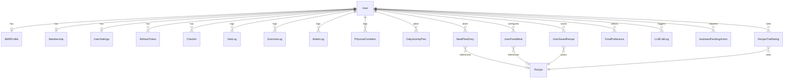
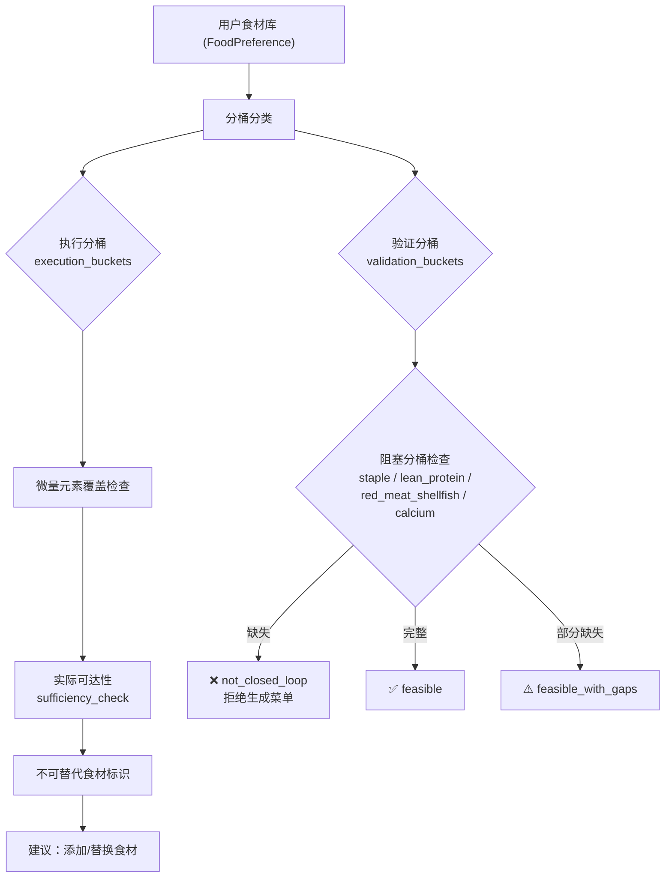
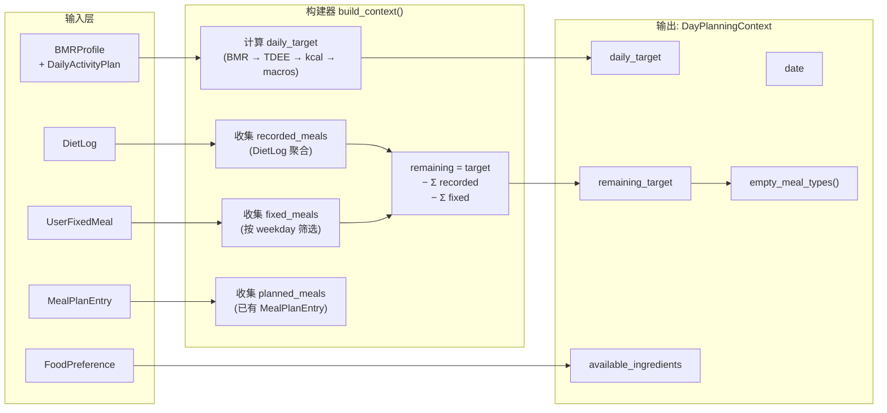

# Compass Health 系统结构文档

> Compass Health 是一个双语 AI 配餐与健康管理系统，采用混合架构（Deterministic Engine + Bounded LLM），
> 围绕真实用户流程设计完整闭环：从健康档案 → 营养审计 → 候选菜池 → 一周餐单 → 采购清单 → 执行反馈。

---

## 目录

- [1. 整体架构](#1-整体架构)
- [2. 技术栈](#2-技术栈)
- [3. 项目目录结构](#3-项目目录结构)
- [4. 后端架构](#4-后端架构)
  - [4.1 入口与生命周期](#41-入口与生命周期)
  - [4.2 数据模型层 (Models)](#42-数据模型层-models)
  - [4.3 路由层 (Routers)](#43-路由层-routers)
  - [4.4 服务层 (Services)](#44-服务层-services)
  - [4.5 认证与安全](#45-认证与安全)
  - [4.6 中间件](#46-中间件)
  - [4.7 日志系统](#47-日志系统)
  - [4.8 定时任务](#48-定时任务)
  - [4.9 数据库迁移](#49-数据库迁移)
- [5. 前端架构 (Web)](#5-前端架构-web)
- [6. 微信小程序 (Miniprogram)](#6-微信小程序-miniprogram)
- [7. 核心业务流程](#7-核心业务流程)
  - [7.1 闭环营养审计](#71-闭环营养审计)
  - [7.2 结构化 Planning Context](#72-结构化-planning-context)
  - [7.3 周餐单规划 (Menu Planner)](#73-周餐单规划-menu-planner)
  - [7.4 采购清单聚合 (Procurement)](#74-采购清单聚合-procurement)
  - [7.5 执行反馈环 (Feedback Loop)](#75-执行反馈环-feedback-loop)
- [8. LLM 使用边界](#8-llm-使用边界)
- [9. 工程设计哲学](#9-工程设计哲学)
- [10. 测试体系](#10-测试体系)
- [11. 部署与运行](#11-部署与运行)

---

## 1. 整体架构

```text
┌─────────────────────────────────────────────────────────────────────┐
│                        Client Layer                                 │
│  ┌──────────────────┐  ┌──────────────────┐  ┌──────────────────┐  │
│  │   Web Frontend   │  │  WeChat Mini-    │  │   API Docs       │  │
│  │  (Vanilla JS SPA)│  │  program (WXML)  │  │  (Swagger UI)    │  │
│  │   :5500          │  │  微信开发者工具    │  │   :8000/docs     │  │
│  └────────┬─────────┘  └────────┬─────────┘  └────────┬─────────┘  │
│           │                     │                     │             │
│           └─────────────────────┼─────────────────────┘             │
│                                 │ HTTP / REST                       │
├─────────────────────────────────┼───────────────────────────────────┤
│                        API Gateway Layer                            │
│  ┌──────────────────────────────┴──────────────────────────────┐    │
│  │                  FastAPI Application (:8000)                 │    │
│  │  ┌─────────────┐  ┌──────────────┐  ┌──────────────────┐   │    │
│  │  │  CORS       │  │  Request ID  │  │  Global Error    │   │    │
│  │  │  Middleware  │  │  Middleware   │  │  Handler         │   │    │
│  │  └─────────────┘  └──────────────┘  └──────────────────┘   │    │
│  └─────────────────────────────────────────────────────────────┘    │
├─────────────────────────────────────────────────────────────────────┤
│                        Router Layer (15 routers)                    │
│  ┌──────────┐ ┌──────────┐ ┌──────────┐ ┌──────────┐              │
│  │ auth     │ │ user     │ │ diet     │ │ meal_plan│              │
│  │ _routes  │ │ _routes  │ │ _routes  │ │ _routes  │              │
│  └──────────┘ └──────────┘ └──────────┘ └──────────┘              │
│  ┌──────────┐ ┌──────────┐ ┌──────────┐ ┌──────────┐              │
│  │ recipe   │ │ meal     │ │ fixed    │ │ prefs    │              │
│  │ _routes  │ │ _engine  │ │ _meal    │ │ _routes  │              │
│  └──────────┘ └──────────┘ └──────────┘ └──────────┘              │
│  ┌──────────┐ ┌──────────┐ ┌──────────┐ ┌──────────┐              │
│  │ water    │ │ exercise │ │ condition│ │ stats    │              │
│  │ _routes  │ │ _routes  │ │ _routes  │ │ _routes  │              │
│  └──────────┘ └──────────┘ └──────────┘ └──────────┘              │
│  ┌──────────┐ ┌──────────┐ ┌──────────────┐                       │
│  │ admin    │ │ daily    │ │ assistant    │                       │
│  │ _routes  │ │ _activity│ │ _routes      │                       │
│  └──────────┘ └──────────┘ └──────────────┘                       │
├─────────────────────────────────────────────────────────────────────┤
│                        Service Layer (23 services)                  │
│  ┌───────────────────────────────────────────────────────────────┐  │
│  │  Deterministic Core                                           │  │
│  │  ┌──────────────┐ ┌──────────────┐ ┌──────────────────┐      │  │
│  │  │ nutrition    │ │ planning     │ │ menu_planner     │      │  │
│  │  │ _audit      │ │ _context     │ │ (week/day/pool)  │      │  │
│  │  └──────────────┘ └──────────────┘ └──────────────────┘      │  │
│  │  ┌──────────────┐ ┌──────────────┐ ┌──────────────────┐      │  │
│  │  │ procurement  │ │ feedback     │ │ calorie          │      │  │
│  │  │              │ │ _loop        │ │ (BMR/TDEE/macro) │      │  │
│  │  └──────────────┘ └──────────────┘ └──────────────────┘      │  │
│  │  ┌──────────────┐ ┌──────────────┐ ┌──────────────────┐      │  │
│  │  │ food_library │ │ recipe       │ │ meal_scheduler   │      │  │
│  │  │ (65K data)   │ │ _matcher     │ │                  │      │  │
│  │  └──────────────┘ └──────────────┘ └──────────────────┘      │  │
│  ├───────────────────────────────────────────────────────────────┤  │
│  │  LLM-Assisted (Bounded)                                       │  │
│  │  ┌──────────────┐ ┌──────────────┐ ┌──────────────────┐      │  │
│  │  │ recipe       │ │ recipe       │ │ deepseek         │      │  │
│  │  │ _suggester   │ │ _assessor    │ │ (API client)     │      │  │
│  │  └──────────────┘ └──────────────┘ └──────────────────┘      │  │
│  │  ┌──────────────┐                                             │  │
│  │  │ assistant    │                                             │  │
│  │  │ _tools       │                                             │  │
│  │  └──────────────┘                                             │  │
│  ├───────────────────────────────────────────────────────────────┤  │
│  │  Support Services                                             │  │
│  │  ┌──────────────┐ ┌──────────────┐ ┌──────────────────┐      │  │
│  │  │ llm_quota    │ │ rate_limit   │ │ saved_recipes    │      │  │
│  │  └──────────────┘ └──────────────┘ └──────────────────┘      │  │
│  │  ┌──────────────┐ ┌──────────────┐ ┌──────────────────┐      │  │
│  │  │ autofill     │ │ local_dates  │ │ weight_tracking  │      │  │
│  │  └──────────────┘ └──────────────┘ └──────────────────┘      │  │
│  │  ┌──────────────┐ ┌──────────────┐ ┌──────────────────┐      │  │
│  │  │ recipe       │ │ engagement   │ │ audit            │      │  │
│  │  │ _access      │ │              │ │ (admin)          │      │  │
│  │  └──────────────┘ └──────────────┘ └──────────────────┘      │  │
│  └───────────────────────────────────────────────────────────────┘  │
├─────────────────────────────────────────────────────────────────────┤
│                        Data Layer                                   │
│  ┌──────────────────────────────────────────────────────────────┐   │
│  │              SQLite (compass.db) via SQLAlchemy               │   │
│  │              20 tables · ORM models · auto-migration          │   │
│  └──────────────────────────────────────────────────────────────┘   │
├─────────────────────────────────────────────────────────────────────┤
│                        External Services                            │
│  ┌──────────────────────────────────────────────────────────────┐   │
│  │     DeepSeek API (OpenAI-compatible)                          │   │
│  │     用途：偏好分类 · 菜品命名 · 做法生成 · 减脂评估             │   │
│  └──────────────────────────────────────────────────────────────┘   │
└─────────────────────────────────────────────────────────────────────┘
```

---

## 2. 技术栈

| 层级 | 技术 | 备注 |
|------|------|------|
| **后端框架** | FastAPI ≥ 0.111 | 异步 ASGI，自动 OpenAPI 文档 |
| **ORM** | SQLAlchemy ≥ 2.0 | 声明式 ORM，懒迁移 |
| **数据库** | SQLite | 零配置，文件级数据库 |
| **数据验证** | Pydantic ≥ 2.0 | 请求/响应模型验证 |
| **认证** | JWT (python-jose) + bcrypt (passlib) | Access + Refresh Token 双令牌 |
| **LLM API** | DeepSeek (OpenAI 兼容) via `openai` SDK | 受控调用，配额限制 |
| **HTTP 客户端** | httpx ≥ 0.25 | 异步 HTTP 请求 |
| **定时任务** | APScheduler ≥ 3.10 | 午夜自动填充 |
| **前端 (Web)** | Vanilla JavaScript + HTML + CSS | 原生 SPA，无框架依赖 |
| **前端 (小程序)** | 微信小程序 (WXML/WXSS/JS) | 复用同一后端 API |
| **国际化** | 自建 i18n.js (81KB) | 中英文双语 |
| **测试** | pytest | 16 个测试模块 |
| **服务器** | Uvicorn | ASGI 服务器 |

---

## 3. 项目目录结构

```text
compass-health/
├── backend/                          # 后端 (FastAPI + Python)
│   ├── main.py                       # 应用入口、生命周期、种子数据、迁移
│   ├── auth.py                       # JWT 认证、密码哈希、密钥校验
│   ├── database.py                   # SQLAlchemy engine / session 配置
│   ├── models.py                     # 20 个 ORM 数据模型
│   ├── middleware.py                 # 请求上下文中间件 (Request ID / Journey ID)
│   ├── logging_config.py            # 结构化 JSON 日志 + ContextVar 过滤器
│   ├── requirements.txt             # Python 依赖声明
│   ├── .env / .env.example          # 环境变量配置
│   ├── compass.db                   # SQLite 数据库文件 (运行时生成)
│   │
│   ├── routers/                     # API 路由层 (15 个路由模块)
│   │   ├── auth_routes.py           # 注册 / 登录 / 刷新令牌
│   │   ├── user_routes.py           # 用户信息 / BMR 档案
│   │   ├── diet_routes.py           # 饮食记录 CRUD
│   │   ├── meal_plan_routes.py      # 周餐单 / 候选菜池 / 营养需求 (68KB 核心路由)
│   │   ├── meal_engine_routes.py    # 配餐引擎 API
│   │   ├── recipe_routes.py         # 菜谱管理 / 社区菜谱
│   │   ├── fixed_meal_routes.py     # 固定餐管理
│   │   ├── preferences_routes.py    # 饮食偏好管理
│   │   ├── water_routes.py          # 饮水记录
│   │   ├── exercise_routes.py       # 运动记录
│   │   ├── condition_routes.py      # 体况记录 (体重/血压/心率/睡眠/情绪)
│   │   ├── daily_activity_routes.py # 每日活动等级
│   │   ├── stats_routes.py          # 统计数据
│   │   ├── admin_routes.py          # 管理后台 (用户/菜谱/审计日志)
│   │   └── assistant_routes.py      # AI 助手交互
│   │
│   ├── services/                    # 业务逻辑层 (23 个服务模块)
│   │   ├── nutrition_audit.py       # 闭环营养审计 (食物库可行性/微量元素覆盖)
│   │   ├── planning_context.py      # 结构化 Planning Context 构建器
│   │   ├── menu_planner.py          # 周餐单规划器 / 候选菜池 / 空槽填充 (86KB 核心)
│   │   ├── procurement.py           # 采购清单聚合
│   │   ├── feedback_loop.py         # 每日/每周执行反馈
│   │   ├── calorie.py               # BMR / TDEE / 热量目标 / 宏量素计算
│   │   ├── food_library.py          # 结构化食材库 (65KB, 含营养素/微量元素数据)
│   │   ├── recipe_suggester.py      # LLM 菜名生成 / 做法语言化
│   │   ├── recipe_matcher.py        # 菜谱匹配 / 食材可用性检查
│   │   ├── recipe_assessor.py       # LLM 菜谱减脂评估
│   │   ├── meal_scheduler.py        # 食材分布校验
│   │   ├── deepseek.py              # DeepSeek API 客户端封装
│   │   ├── llm_quota.py             # LLM 调用配额管理
│   │   ├── rate_limit.py            # 速率限制
│   │   ├── saved_recipes.py         # 用户保存菜谱 (上限 20)
│   │   ├── autofill.py              # 午夜自动填充逻辑
│   │   ├── assistant_tools.py       # AI 助手工具集 (37KB)
│   │   ├── recipe_access.py         # 菜谱访问权限
│   │   ├── local_dates.py           # 本地时区日期工具
│   │   ├── weight_tracking.py       # 体重趋势追踪
│   │   ├── engagement.py            # 用户活跃度指标
│   │   ├── audit.py                 # 管理员审计操作
│   │   └── food_library.py          # 完整食材库定义
│   │
│   ├── tests/                       # 测试套件 (16 个测试模块)
│   │   ├── conftest.py              # 测试 fixtures (内存 DB / 测试用户)
│   │   ├── test_auth.py             # 认证流程测试
│   │   ├── test_admin.py            # 管理后台测试
│   │   ├── test_meal_plan_arrange.py # 配餐安排测试 (32KB 核心测试)
│   │   ├── test_nutrition_audit.py  # 营养审计测试
│   │   ├── test_recipe_suggester.py # 菜名生成测试
│   │   ├── test_recipe_access.py    # 菜谱权限测试
│   │   ├── test_diet_routes.py      # 饮食记录测试
│   │   ├── test_community_recipes.py # 社区菜谱测试
│   │   ├── test_condition_weight.py # 体况记录测试
│   │   ├── test_input_validation.py # 输入校验测试
│   │   ├── test_llm_quota.py        # LLM 配额测试
│   │   ├── test_assistant.py        # AI 助手测试
│   │   ├── test_menu_planner_guidance.py # 配餐引导测试
│   │   ├── test_preferences_routes.py # 偏好路由测试
│   │   └── test_user_activity_level.py # 活动等级测试
│   │
│   └── scripts/                     # 工具脚本
│       ├── fetch_cdr_nutrients.py   # CDR 营养素数据抓取
│       ├── migrate_refresh_tokens_to_hash.py  # 令牌迁移
│       ├── migrate_spec_v1.py       # Spec-v1 数据迁移
│       ├── smoke_phase5.py          # Phase 5 冒烟测试
│       ├── smoke_phase6.py          # Phase 6 冒烟测试
│       └── smoke_phase7.py          # Phase 7 冒烟测试
│
├── frontend/                        # Web 前端 (原生 JS SPA)
│   ├── index.html                   # 单页入口 (9.5KB)
│   ├── css/
│   │   └── styles.css               # 全局样式 (101KB)
│   └── js/
│       ├── api.js                   # API 请求封装 (30KB)
│       ├── app.js                   # 路由 / 页面切换 / 生命周期
│       ├── auth.js                  # 前端认证状态管理
│       ├── i18n.js                  # 中英文国际化 (81KB)
│       ├── assistant_widget.js      # AI 助手悬浮组件
│       └── pages/                   # 页面模块 (13 个)
│           ├── auth.js              # 登录 / 注册页
│           ├── dashboard.js         # 首页概览
│           ├── diet.js              # 饮食记录 (56KB)
│           ├── meal_engine.js       # AI 配餐引擎 (97KB 最大页面)
│           ├── bmr.js               # BMR 档案编辑
│           ├── preferences.js       # 饮食偏好管理
│           ├── exercise.js          # 运动记录
│           ├── water.js             # 饮水记录
│           ├── condition.js         # 体况记录
│           ├── stats.js             # 数据统计
│           ├── settings.js          # 系统设置
│           ├── admin.js             # 管理后台 (49KB)
│           └── community_recipes.js # 社区菜谱
│
├── miniprogram/                     # 微信小程序 MVP
│   ├── app.js                       # 小程序入口
│   ├── app.json                     # 页面与 TabBar 配置
│   ├── app.wxss                     # 全局样式
│   ├── project.config.json          # 开发者工具配置
│   ├── pages/                       # 小程序页面
│   │   ├── login/                   # 登录 / 注册
│   │   ├── dashboard/               # 首页概览
│   │   ├── diet/                    # 饮食记录
│   │   ├── meal-plan/               # AI 配餐
│   │   ├── stats/                   # 统计
│   │   └── settings/                # 设置
│   ├── utils/                       # 工具模块
│   │   ├── request.js               # HTTP 请求封装
│   │   ├── labels.js                # 标签工具
│   │   └── format.js                # 格式化工具
│   └── assets/                      # 图标资源
│
├── start.bat                        # Windows 一键启动脚本
├── stop.bat                         # Windows 一键停止脚本
├── build_merged.py                  # 代码合并构建工具
├── pytest.ini                       # pytest 配置
├── README.md                        # 项目说明 (入口)
├── README.zh-CN.md                  # 中文详细说明
├── README.en.md                     # 英文详细说明
├── AGENTS.md                        # AI Agent 交互设计原则
└── CLAUDE.md                        # Claude 协作指南
```

---

## 4. 后端架构

### 4.1 入口与生命周期

**入口文件**: `backend/main.py`

```text
Startup 流程:
  1. configure() → 初始化日志系统 (dictConfig)
  2. Base.metadata.create_all() → 创建数据库表
  3. run_migrations() → 增量列迁移 (ALTER TABLE)
  4. seed_builtin_recipes() → 种子数据 (13 道内置菜谱)
  5. BackgroundScheduler.start() → 启动定时任务

Shutdown 流程:
  1. scheduler.shutdown() → 停止后台调度器
```

**CORS 配置**: 允许 `localhost:5500` / `localhost:8080` / `localhost:3000` 和 `null` (本地开发 file:// 协议)。

---

### 4.2 数据模型层 (Models)

`backend/models.py` 定义了 **20 个** SQLAlchemy ORM 模型：



#### 模型清单

| 模型 | 表名 | 职责 |
|------|------|------|
| **User** | `users` | 用户账号 (用户名/邮箱/密码/语言/管理员标识) |
| **BMRProfile** | `bmr_profiles` | 基础代谢档案 (年龄/性别/身高/体重/目标) |
| **DailyActivityPlan** | `daily_activity_plans` | 每日活动等级 (替代旧的固定 activity_level) |
| **RefreshToken** | `refresh_tokens` | 刷新令牌存储 |
| **Membership** | `memberships` | 会员等级 (free/normal/pro/pro_max) |
| **UserSettings** | `user_settings` | 用户设置 (饮水目标/提醒间隔/语言) |
| **DietLog** | `diet_logs` | 饮食记录 (餐次/食物名/热量/宏量素) |
| **ExerciseLog** | `exercise_logs` | 运动记录 (类型/时长/消耗) |
| **WaterLog** | `water_logs` | 饮水记录 |
| **PhysicalCondition** | `physical_conditions` | 体况记录 (体重/血压/心率/睡眠/情绪) |
| **CheckIn** | `checkins` | 每日打卡 |
| **Recipe** | `recipes` | 菜谱 (食材/步骤/营养素/社区评分/减脂评级) |
| **RecipeTrialRating** | `recipe_trial_ratings` | 菜谱试做评分 (口味/饱腹感/难度/复做意愿) |
| **MealPlanEntry** | `meal_plan_entries` | 餐单条目 (日期/餐次/菜谱/份量/状态) |
| **UserFixedMeal** | `user_fixed_meals` | 固定餐配置 (按星期/餐次绑定菜谱) |
| **UserSavedRecipe** | `user_saved_recipes` | 用户菜谱库 (上限 20) |
| **FoodPreference** | `food_preferences` | 食材偏好 (slug 级粒度) |
| **LLMCallLog** | `llm_call_log` | LLM 调用计数 (配额管理) |
| **UserNutritionMemory** | `user_nutrition_memory` | 用户营养记忆 (JSON 存储) |
| **AssistantPendingAction** | `assistant_pending_actions` | AI 助手待处理操作 |
| **DailyMealPlanConfirmation** | `daily_meal_plan_confirmations` | 餐单确认记录 |
| **MissingRecipeReport** | `missing_recipe_reports` | 缺失菜谱反馈 |
| **AdminAuditLog** | `admin_audit_logs` | 管理员审计日志 (不可变) |

#### 关键设计

- **MealPlanEntry.status**: 使用优先级链 `recorded > fixed > recipe > generated`，状态由 `planning_context.py` 统一管理
- **Recipe.ingredients_json**: Spec-v1 结构化食材字段 `[{slug, grams, required}]`，支持采购聚合和匹配
- **UniqueConstraint**: 所有日级数据 (活动/体况/餐单/打卡) 均设 `(user_id, date)` 或 `(user_id, date, meal_type)` 唯一约束

---

### 4.3 路由层 (Routers)

15 个路由模块，按业务领域划分：

| 路由 | 前缀 | 体积 | 核心职责 |
|------|------|------|----------|
| `auth_routes` | `/api/auth` | 10KB | 注册/登录/刷新/登出 |
| `user_routes` | `/api/users` | 14KB | 用户信息/BMR 档案 CRUD |
| `diet_routes` | `/api/diet` | 19KB | 饮食记录 CRUD + 统计 |
| `meal_plan_routes` | `/api/meal-plan` | **69KB** | 周餐单/候选菜池/营养需求/采购清单/空槽填充 |
| `meal_engine_routes` | `/api/meal-engine` | 11KB | 配餐引擎 API |
| `recipe_routes` | `/api/recipes` | 13KB | 菜谱 CRUD / 社区菜谱 |
| `fixed_meal_routes` | `/api/fixed-meals` | 12KB | 固定餐管理 |
| `preferences_routes` | `/api/preferences` | 15KB | 饮食偏好 / 食材库 |
| `water_routes` | `/api/water` | 4KB | 饮水记录 |
| `exercise_routes` | `/api/exercise` | 4KB | 运动记录 |
| `condition_routes` | `/api/condition` | 7KB | 体况记录 / 体重追踪 |
| `daily_activity_routes` | `/api/activity` | 4KB | 每日活动等级 |
| `stats_routes` | `/api/stats` | 4KB | 统计数据 |
| `admin_routes` | `/api/admin` | 39KB | 管理后台 (用户/菜谱/审计/LLM日志) |
| `assistant_routes` | `/api/assistant` | 15KB | AI 助手交互 |

---

### 4.4 服务层 (Services)

服务层是系统的核心大脑，按关注点分为三类：

#### 确定性核心 (Deterministic Core)

这些模块 **不依赖任何 LLM 调用**，输出完全可预测、可测试：

| 服务 | 体积 | 职责 |
|------|------|------|
| `food_library.py` | **65KB** | 完整食材数据库：每种食材的营养素/100g、微量元素角色、执行分桶、验证分桶、交换当量 |
| `menu_planner.py` | **86KB** | 三种模式：`generate_dish_pool` (候选菜池) / `fill_empty_slots` (空槽填充) / `week_plan` (7天规划) |
| `nutrition_audit.py` | 21KB | 闭环营养审计：分桶覆盖/微量元素覆盖/实际可达性/不可替代食材/建议 |
| `planning_context.py` | 16KB | 构建 day-level Planning Context，管理优先级链 |
| `calorie.py` | 18KB | BMR (Mifflin-St Jeor) / TDEE / 热量目标 / 宏量素计算 |
| `procurement.py` | 10KB | 采购清单聚合：优先级投影 → 食材展开 → 分桶汇总 |
| `feedback_loop.py` | 13KB | 每日报告 + 每周复盘 + 调整建议 |
| `recipe_matcher.py` | 14KB | 菜谱匹配：食材可用性检查、day-level 最优选择 |
| `meal_scheduler.py` | 8KB | 食材分布校验（避免同一食材在池中占比过高） |

#### LLM 辅助层 (Bounded LLM)

LLM **仅用于自然语言包装**，决策逻辑保留在确定性引擎中：

| 服务 | 体积 | 职责 | LLM 用途 |
|------|------|------|----------|
| `recipe_suggester.py` | 31KB | 菜品命名、做法生成 | 给食材草案起可读名称 |
| `recipe_assessor.py` | 12KB | 菜谱减脂评估 | 评分 + 文字点评 |
| `assistant_tools.py` | 37KB | AI 助手工具集 | 对话式交互 |
| `deepseek.py` | 1KB | DeepSeek API 客户端 | HTTP 请求封装 |

#### 支撑服务 (Support)

| 服务 | 体积 | 职责 |
|------|------|------|
| `llm_quota.py` | 7KB | LLM 调用配额管理（按会员等级/时间窗口） |
| `rate_limit.py` | 3KB | API 速率限制 |
| `saved_recipes.py` | 6KB | 用户菜谱库管理（上限 20） |
| `autofill.py` | 3KB | 午夜自动填充（将未确认的计划转为饮食记录） |
| `local_dates.py` | 2KB | 本地时区日期工具 |
| `weight_tracking.py` | 3KB | 体重趋势追踪 |
| `engagement.py` | 1KB | 用户活跃度指标 |
| `recipe_access.py` | 1KB | 菜谱访问权限检查 |
| `audit.py` | 2KB | 管理员审计操作 |

---

### 4.5 认证与安全

```text
认证流程:
  ┌──────┐  POST /api/auth/login  ┌──────┐
  │Client├───────────────────────►│Server│
  │      │  (username + password)  │      │
  │      │◄───────────────────────┤      │
  │      │  {access_token,         │      │
  │      │   refresh_token}        │      │
  └──┬───┘                        └──────┘
     │
     │  Authorization: Bearer <access_token>
     │  (每次 API 请求)
     │
     │  access_token 过期 (默认30分钟)
     │
     │  POST /api/auth/refresh
     │  {refresh_token}
     │  → 新的 access_token
```

**安全特性**:
- **SECRET_KEY 校验**: 启动时强制验证密钥强度，拒绝占位符和过短密钥
- **ALLOW_WEAK_SECRET**: 本地开发旁路，记录警告日志
- **bcrypt**: 密码哈希 (passlib)
- **JWT**: HS256 签名的 Access Token
- **Refresh Token**: 128 字符随机 hex，数据库存储

---

### 4.6 中间件

`RequestContextMiddleware` 在每个请求上执行：

```text
入站:
  1. 提取/生成 Request-ID (支持客户端传入 X-Request-ID)
  2. 提取/生成 Journey-ID (支持 X-Journey-ID)
  3. 解析 UI Action 标签 (X-UI-Action)
  4. 从 JWT 中无感提取 user_id (仅用于日志关联，不做授权)
  5. 注入 ContextVar → 所有日志自动携带上下文

出站:
  1. 计算请求耗时 (ms)
  2. 发射结构化访问日志 (跳过健康检查噪声)
  3. 注入响应头 X-Request-ID / X-Journey-ID
  4. 清理 ContextVar
```

---

### 4.7 日志系统

**五个日志通道**:

| Logger | 用途 | 输出 |
|--------|------|------|
| `compass.app` | 通用应用事件 | stdout + app.log |
| `compass.auth` | 登录/登出/注册 | stdout + app.log |
| `compass.access` | HTTP 请求 (每行一条) | stdout + app.log |
| `compass.llm` | DeepSeek API 调用 | stdout + app.log |
| `compass.audit` | 管理员操作 (90天留存) | stdout + audit.log |

**日志格式**: 文件使用 JSON 格式，控制台使用可读文本。每条日志自动携带 `request_id`, `journey_id`, `user_id`, `ui_action` 四维上下文。

---

### 4.8 定时任务

| 任务 | 时间 | 职责 |
|------|------|------|
| `midnight_autofill` | 每天 00:00 UTC | 将前一天未确认的餐单槽位自动转为饮食记录 |

---

### 4.9 数据库迁移

采用 **增量列迁移** (Additive ALTER TABLE) 策略：

- 启动时通过 `run_migrations()` 检查现有列
- 缺失的列通过 `ALTER TABLE ADD COLUMN` 添加
- 无需外部迁移工具 (如 Alembic)
- 适用于 SQLite 的只增不删特性

---

## 5. 前端架构 (Web)

**技术方案**: 纯原生 JavaScript SPA，无 React/Vue 等框架依赖。

```text
frontend/
├── index.html             # 单页入口，动态路由容器
├── css/styles.css         # 101KB 全局样式
└── js/
    ├── api.js             # API 请求层 (JWT 管理、自动刷新、错误处理)
    ├── app.js             # 路由器 + 页面生命周期管理
    ├── auth.js            # 认证状态 (Token 存储/刷新/过期检测)
    ├── i18n.js            # 中英文国际化 (81KB, 完整翻译表)
    ├── assistant_widget.js # AI 助手浮窗组件
    └── pages/             # 13 个页面模块
```

#### 页面模块

| 页面 | 体积 | 功能 |
|------|------|------|
| `meal_engine.js` | **97KB** | AI 配餐引擎：候选菜池 → 菜名生成 → 保存 → 安排 → 采购 |
| `diet.js` | 56KB | 饮食记录：餐次管理/快速添加/宏量素仪表盘 |
| `admin.js` | 49KB | 管理后台：用户管理/菜谱审核/审计日志/系统统计 |
| `dashboard.js` | 28KB | 首页：概览卡片/每日进度/打卡/快捷入口 |
| `settings.js` | 21KB | 设置：语言/饮水/活动等级/密码/账户 |
| `community_recipes.js` | 16KB | 社区菜谱：浏览/评分/提交 |
| `preferences.js` | 16KB | 饮食偏好：食材选择/搜索/分类 |
| `stats.js` | 12KB | 统计：趋势图/周报/热量对比 |
| `condition.js` | 10KB | 体况记录：体重/血压/心率/睡眠/情绪 |
| `auth.js` | 10KB | 登录/注册：表单验证/错误提示 |
| `bmr.js` | 9KB | BMR 档案：身体数据/目标设定 |
| `exercise.js` | 7KB | 运动记录：类型/时长/消耗 |
| `water.js` | 7KB | 饮水记录：快捷添加/每日目标 |

#### 前端架构特点

- **纯 JS SPA**: 所有页面在 `index.html` 内动态渲染，通过 `app.js` 管理路由
- **API 层封装**: `api.js` 统一处理 JWT 注入、Token 自动刷新、Request-ID 生成、Journey-ID 追踪
- **完整 i18n**: 81KB 的翻译表覆盖所有 UI 文本，运行时切换
- **模块化页面**: 每个页面是一个独立 JS 模块，通过 `render()` 和生命周期钩子与框架交互

---

## 6. 微信小程序 (Miniprogram)

**定位**: MVP 版本，复用同一 FastAPI 后端。

#### TabBar 导航 (5 个主页面)

| Tab | 页面 | 功能 |
|-----|------|------|
| 首页 | `pages/dashboard` | 概览 |
| 饮食 | `pages/diet` | 饮食记录 |
| 配餐 | `pages/meal-plan` | AI 配餐 |
| 统计 | `pages/stats` | 数据统计 |
| 设置 | `pages/settings` | API 地址/档案/偏好/登出 |

#### 工具模块

| 模块 | 职责 |
|------|------|
| `utils/request.js` | HTTP 请求封装 (wx.request + JWT 管理) |
| `utils/labels.js` | 标签映射工具 |
| `utils/format.js` | 数据格式化 |

---

## 7. 核心业务流程

### 7.1 闭环营养审计



**审计四问**:
1. **最小闭环**: 食物库是否覆盖所有阻塞分桶？
2. **微量元素覆盖**: 关键营养素（钙/铁/锌/碘/硒/维A/D/E/K/B12/叶酸/omega3/纤维）是否有载体？
3. **实际可达性**: 在正常食用量下，载体食物能否覆盖 ≥10% RDA？
4. **不可替代性**: 哪些食物是某个分桶/营养素的唯一载体？

---

### 7.2 结构化 Planning Context



**优先级链**: `recorded (4) > fixed (3) > recipe (2) > generated (1) > empty (0)`

- 用户真实记录 > 固定餐 > 已保存菜谱 > 系统生成
- `highest_priority_slot()` 统一应用，采购清单和前端展示都用同一投影

---

### 7.3 周餐单规划 (Menu Planner)

三种模式，由上层路由按场景选择：

```text
模式 1: generate_dish_pool(db, user)
  ├── 生成 ~30 道候选菜品 (6 早餐 + 24 午/晚共享主菜)
  ├── 食材多样性校验 (同一食材不超过池大小的 20%)
  ├── 每道菜带食材集和宏量素总和
  └── 用户从中选择 → 保存到菜谱库

模式 2: fill_empty_slots(db, user, date_str)
  ├── 读取 DayPlanningContext，找出空槽
  ├── Day-level 匹配：recipe_matcher.pick_day_set() 联合选择
  ├── 按 meal_types 标签 + kcal 大小分配到槽位
  ├── 库中无匹配 → 回退到确定性求解器 (compose_meal)
  └── 纯函数，不写数据库

模式 3: week_plan(db, user)
  ├── 7 天日历构建 (含活动等级 + 日类型)
  ├── 红肉/深海鱼 强化日插入
  ├── 每天 3 餐 × compose_meal (贪心求解)
  ├── 每周覆盖率检查 (weekly_floor 不足 → 警告)
  └── 输出: nutrition_requirements + solved_picks
```

**日类型系统**:

| 日类型 | 中文 | 蛋白质优先级 |
|--------|------|-------------|
| `low_activity` | 低活动日 | 慢碳优先 |
| `moderate_activity` | 中等活动日 | 平衡 |
| `high_activity` | 高活动日 | 快碳优先 |
| `red_meat_day` | 红肉强化日 | 红肉 > 白肉 |
| `deep_sea_fish_day` | 深海鱼强化日 | 深海鱼 > 贝类 |
| `pantry_clearance` | 灵活清库日 | 灵活 |

**餐次热量分配**: 早餐 25% · 午餐 40% · 晚餐 35%

---

### 7.4 采购清单聚合 (Procurement)

```text
输入:
  project_week() → 7 天 DayPlanningContext (优先级已投影)

处理:
  对每个 slot:
    fixed → UserFixedMeal → Recipe.ingredients_json → 按 portion_g/serving_g 缩放
    planned → MealPlanEntry → Recipe.ingredients_json → 按 portion_g/serving_g 缩放
    recorded → 跳过 (已消费)

  gram_totals[slug] += scaled_grams
  recommended = gram_totals × 1.15 (安全缓冲 15%)
  round_up 到最近 10g

输出:
  按 execution_bucket 分组:
    每行: slug / name_zh / name_en / planned_g / recommended_g /
          meal_count / is_key_food / replaceable
```

---

### 7.5 执行反馈环 (Feedback Loop)

#### 每日报告 `daily_report()`

```text
比较维度:
  ├── 目标热量 vs 实际热量 → kcal 状态 (on_track / over / under)
  ├── 目标蛋白质 vs 实际蛋白质 → protein 状态
  ├── 目标碳水 vs 实际碳水 → carbs 状态
  ├── 目标脂肪 vs 实际脂肪 → fat 状态
  ├── 运动消耗 → net_kcal
  └── 计划 vs 实际记录 → planned_slots_fulfilled

阈值:
  kcal: >115% = over, <80% = under
  protein: <80% = under, >130% = over
  fat: <70% = under, >140% = over
```

#### 每周复盘 `weekly_review()`

```text
聚合 7 天数据:
  ├── 各宏量素周平均
  ├── 体重趋势 (earliest vs latest)
  ├── 调整建议:
  │   ├── 体重下降太慢 → calorie_down (-5%)
  │   ├── 体重下降太快 → calorie_up (+5%)
  │   ├── 蛋白质持续不足 (<85%) → protein_up
  │   └── 碳水持续超标 (>120%) → carb_trim
  └── 被跳过的食物检测:
      计划 ≥2 次但从未记录 → 建议替换
```

---

## 8. LLM 使用边界

Compass Health 采用 **有边界的 LLM 使用** 策略：

```text
┌──────────────────────────────────────────────────┐
│                确定性引擎 (本地逻辑)                │
│  ✅ BMR / TDEE / 热量目标计算                      │
│  ✅ 营养审计 (闭环可行性/微量元素覆盖)              │
│  ✅ Planning Context 构建                          │
│  ✅ 候选菜池组合 + 食材多样性校验                   │
│  ✅ 周计划排布 (日类型/活动/强化日)                 │
│  ✅ 采购清单聚合                                    │
│  ✅ 执行反馈 (日报/周报/调整建议)                   │
│  ✅ 菜谱匹配 + 空槽填充                            │
└──────────────────────────────────────────────────┘

┌──────────────────────────────────────────────────┐
│                LLM 辅助 (DeepSeek API)             │
│  🤖 自由文本饮食偏好 → 标准 slug 映射              │
│  🤖 候选菜品草案 → 可读菜名                        │
│  🤖 食材组合 → 做法说明文本                        │
│  🤖 菜谱减脂评估 + 文字点评                        │
│  🤖 AI 助手对话交互                                │
└──────────────────────────────────────────────────┘
```

**配额管理**: 通过 `LLMCallLog` + `llm_quota.py` 按会员等级限制调用频率。

---

## 9. 工程设计哲学

### 9.1 受控式工具编排 vs 开放式 Agent 自由决策

系统不把「调用什么工具」全交给模型，而是由工程流程明确约束：

```text
审计 → 生成候选池 → 命名 → 用户选择 → 安排周计划 → 聚合采购清单
```

每一步的输入/输出/前置条件都是确定性的，LLM 只在需要自然语言包装时介入。

### 9.2 结构化 Memory vs 拼接聊天历史

系统的核心记忆是落在数据库里的 **结构化状态**：

- 用户画像 (BMRProfile)
- 用户设置 (UserSettings)
- 饮食偏好 (FoodPreference)
- 固定餐 (UserFixedMeal)
- 已保存菜谱 (UserSavedRecipe)
- 饮食/运动/体况历史 (DietLog / ExerciseLog / PhysicalCondition)
- 已生成计划 (MealPlanEntry)

`planning_context.py` 将这些状态组装成 day-level context，而不是简单拼接对话历史。

### 9.3 优先级链驱动的数据一致性

```text
recorded (4) > fixed (3) > recipe (2) > generated (1) > empty (0)
```

这条规则贯穿：
- **写入层**: DietLog 创建时自动 flip MealPlanEntry 状态
- **读取层**: `project_week()` 投影时统一过滤
- **采购层**: 只聚合 priority 生效的 slot
- **反馈层**: 比较的是 recorded 数据，不是 plan 数据

### 9.4 韧性设计

| 机制 | 实现 |
|------|------|
| **LLM 配额** | 按会员/时间窗口计数，超限拒绝 |
| **速率限制** | 关键 API 端点限流 |
| **全局异常处理** | 500 错误从不泄露堆栈，返回 request_id 便于定位 |
| **日志关联** | request_id + journey_id + user_id 贯穿全链路 |
| **审计日志** | 管理员操作不可变记录，90天留存 |
| **密钥校验** | 启动时拒绝弱/占位符密钥 |
| **自动迁移** | 新列只增不删，兼容旧数据 |
| **种子数据** | 首次启动自动灌入 13 道内置菜谱 |

---

## 10. 测试体系

```text
运行方式: pytest (backend 根目录)
Fixture: conftest.py → 内存 SQLite + 测试用户 + 自动事务回滚

测试覆盖:
  ├── test_auth.py                 # 注册/登录/JWT 流程
  ├── test_admin.py                # 管理后台 CRUD + 权限
  ├── test_meal_plan_arrange.py    # 配餐安排 (32KB, 核心测试)
  ├── test_nutrition_audit.py      # 营养审计正确性
  ├── test_recipe_suggester.py     # 菜名生成 (mock LLM)
  ├── test_recipe_access.py        # 菜谱权限 (会员等级)
  ├── test_diet_routes.py          # 饮食记录 CRUD
  ├── test_community_recipes.py    # 社区菜谱流程
  ├── test_condition_weight.py     # 体况/体重记录
  ├── test_input_validation.py     # 输入边界校验
  ├── test_llm_quota.py            # 配额计数
  ├── test_assistant.py            # AI 助手工具
  ├── test_menu_planner_guidance.py # 配餐引导逻辑
  ├── test_preferences_routes.py   # 偏好 API
  └── test_user_activity_level.py  # 活动等级
```

另有阶段式冒烟测试脚本：
- `scripts/smoke_phase5.py` — Phase 5 端到端
- `scripts/smoke_phase6.py` — Phase 6 端到端
- `scripts/smoke_phase7.py` — Phase 7 端到端

---

## 11. 部署与运行

### 本地运行

**方式 A: 一键启动**
```bash
双击 start.bat    # 自动启动前后端并打开浏览器
双击 stop.bat     # 停止所有进程
```

**方式 B: 手动启动**
```bash
# 后端
cd backend
pip install -r requirements.txt
uvicorn main:app --reload     # :8000

# 前端
cd frontend
python -m http.server 5500    # :5500
```

### 访问地址

| 服务 | 地址 |
|------|------|
| Web App | http://localhost:5500 |
| API | http://localhost:8000 |
| API Docs (Swagger) | http://localhost:8000/docs |

### 环境变量 (backend/.env)

| 变量 | 说明 |
|------|------|
| `SECRET_KEY` | JWT 签名密钥 (≥32 字符) |
| `ALGORITHM` | JWT 算法 (默认 HS256) |
| `ACCESS_TOKEN_EXPIRE_MINUTES` | Access Token 有效期 |
| `REFRESH_TOKEN_EXPIRE_DAYS` | Refresh Token 有效期 |
| `DATABASE_URL` | 数据库连接串 |
| `DEEPSEEK_API_KEY` | DeepSeek API 密钥 |
| `LOG_DIR` | 日志目录 |
| `ALLOW_WEAK_SECRET` | 允许弱密钥 (仅本地开发) |
| `TRUST_PROXY` | 信任代理头 |

---

> **文档版本**: 基于 2026-06-11 代码库状态生成
